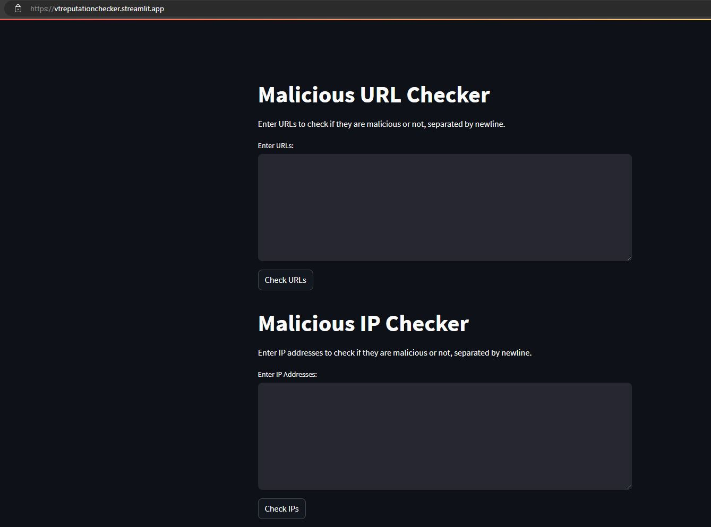

# Reputation Checker Web App

 

This web app allows users to check the reputation of IP addresses and domains using the VirusTotal API.

## Features

- Check the reputation of multiple IP addresses or domains at once.
- Display the results indicating whether the IP/domain is malicious or not.
- User-friendly interface with input fields and buttons.

## How to Use

1. Clone the repository:
```bash
   git clone https://github.com/your-username/your-repo.git
```
2. Navigate to the project directory:
```bash
cd reputation-checker
```
3. Install the required dependencies:
```bash
pip install -r requirements.txt
```
4. Obtain a VirusTotal API Key:
- Sign up for a VirusTotal account if you don't have one.
- Create a new API key in your account settings.
- Replace 'YOUR_VT_API_KEY' in app.py with your actual API key.
5. Run the streamlit App:
 ```bash
streamlit run app.py
```
## Technologies Used
- Streamlit: Python library for creating web applications with minimal effort.
- VirusTotal API: Used to retrieve reputation information for IPs and domains.
- 
## Acknowledgments
This project was created as part of reducing the task of checking multiple IPs and Domains 
